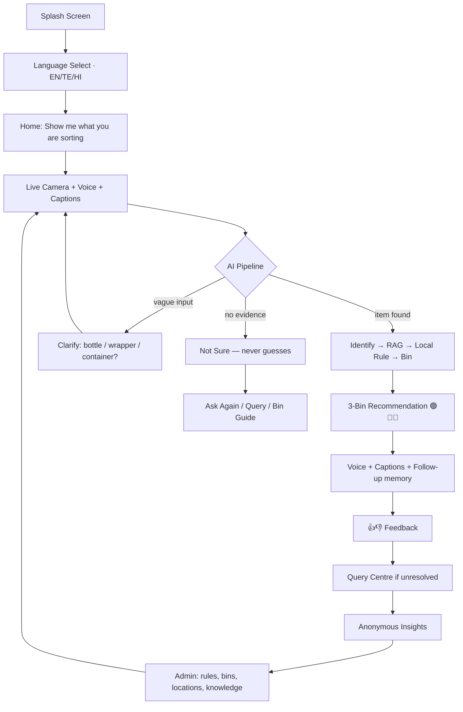
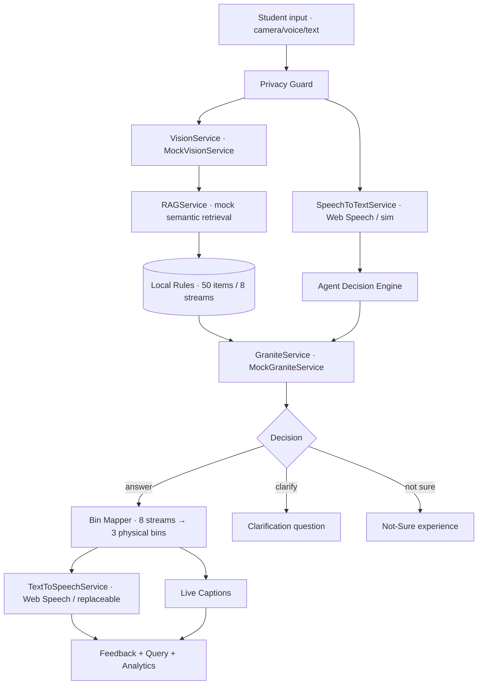
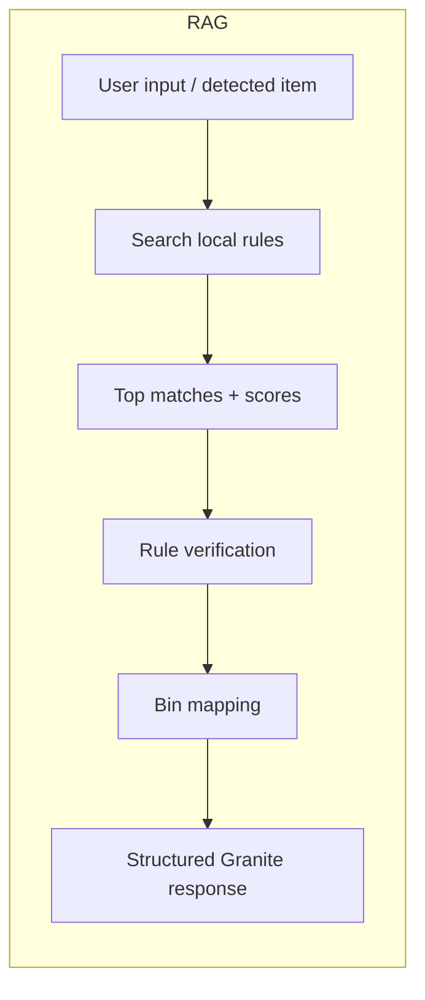
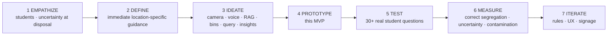

# ♻️ WasteWise AI

> **Know it. Sort it. Dispose right.**
> Point. Ask. Sort correctly.

WasteWise AI is a **multimodal AI waste-segregation assistant** that helps students and residents determine the correct disposal stream **at the exact moment they are about to dispose of an item** — via live camera, natural voice conversation, live captions, RAG-grounded local rules, and a configurable 3-bin mapping.

**This repository is a high-fidelity, fully navigable MVP prototype.** Real AI services are mocked behind clean service interfaces (Demo Mode) so the entire product loop is demonstrable end-to-end without API keys.

---
## 🔗 live production link

### [visit](https://wastewise-ai-h7fi.onrender.com)

---
## 📌 Problem & Pain Point

| | |
|---|---|
| **Problem** | People need immediate, understandable, **location-specific** guidance while disposing of waste. |
| **Pain point** | Confusion at the bin → guessing → wrong bin → mixed waste → contamination → harder recovery → more residual waste. |
| **Why existing approaches fail** | Static posters are ignored; generic web searches ignore **local rules**; chatbots lack camera/voice context and don't connect to **physical bins**. |

## 👥 Users & Stakeholders

- **Primary:** students, residents
- **Institutional:** campus / hostel / housing-society administrators, municipal sanitation teams, waste-management organisations
- **Proposed pilot (not yet validated customers):** university cafeteria, hostel

## ✨ Solution — the complete loop

```
CAMERA + VOICE + AI + LOCAL RULES + BIN MAPPING + CONVERSATION + FEEDBACK + QUERY + INSIGHTS

USER → WASTEWISE → IDENTIFICATION → LOCAL GUIDANCE → CORRECT DISPOSAL → FEEDBACK
     → QUERY → ADMIN INSIGHT → RULE/UX IMPROVEMENT → BETTER FUTURE GUIDANCE
```

### Final demo story
Student in cafeteria sees a banana peel → opens WasteWise → camera → *"Scanning… Identifying… Banana peel detected"* → asks *"Where should I put this?"* → AI (Vision → RAG → Local rule → Bin mapping → Granite) speaks + captions: **"Place it in the Wet / Biodegradable bin"** → student asks *"Why?"* → grounded reason shown → student says *"Our campus tells us differently"* → Query Centre opens prefilled → query `WW-Q-1042` appears in the Admin dashboard → institution improves the local rule.

---

## 🧭 Complete User Journey



## 🏗️ AI Architecture





## 🗑️ The 3-Bin Deployment Model

| Physical bin | Colour | Default mapped streams |
|---|---|---|
| 🟢 Wet / Biodegradable | green | Organic |
| 🔵 Dry / Recyclable | blue | Paper, Plastic, Metal, Glass |
| 🔴 Special / Hazardous | red | E-waste, Hazardous, Sanitary |

> **Important:** this is a **configurable deployment model**, not a universal legal standard. The AI backend keeps **8 detailed internal streams**; admins map them to the bins physically available at each location (`Admin → Bins`).

## 📄 Pages in this prototype

Splash · Language · Home · Live Camera (permission + fallback states) · AI Scanning/Identifying · Voice Listening · AI Speaking · Result · Clarification · Not-Sure · Text fallback · Bin Guide + Search · Query Centre (submit, auto-capture from conversation) · Feedback · Insights Dashboard · Admin (Overview / Queries / Locations+QR / Bins / Knowledge) · Settings · Privacy · Responsible AI · Help · About · Demo & Deployment info · Offline state.

**Student navigation stays minimal:** Home · Scan · Guide · Queries · Settings.

## 🌐 Multilingual

Full i18n (`en` / `te` / `hi`) for navigation, buttons, captions, AI responses, errors, settings, onboarding — the selected language persists per session.

## 🔐 Privacy & Responsible AI

- Camera for identification only; raw media **not stored** by default
- Privacy Guard strips phone numbers / emails from input
- Anonymous query & feedback identifiers; no student accounts needed
- API keys never exposed to the browser (`.env.example` only)
- **Grounded answers** from retrieved local rules, sources shown, safe "How the AI decided" summary — never hidden chain-of-thought
- AI can **clarify** or say **"Not sure"** — no hallucination

## 🧪 Demo Mode

The prototype runs **entirely without API keys**:

| Capability | Prototype | Production swap |
|---|---|---|
| Vision | `MockVisionService` (demo item picker) | `POST /api/vision` |
| STT | Web Speech API → simulated listening | `POST /api/speech` |
| TTS | `speechSynthesis` abstraction | any TTS provider |
| RAG | mock semantic retrieval over local rules | FAISS/Chroma + embeddings |
| Granite | `MockGraniteService` structured output | watsonx.ai Granite |
| Analytics | demo dataset + local interactions | `GET /api/insights` |

## 🔧 Tech & Run

```
wastewise-ai/
├── index.html          # all screens (mobile-first shell)
├── css/style.css       # design system
└── js/
    ├── i18n.js         # en / te / hi translation files
    ├── data.js         # ~50 item KB · 8 streams · local rules · demo data
    └── app.js          # services, agent, router, dashboards
```

**Run:** no build step required — serve statically and open:

```bash
cd wastewise-ai && python3 -m http.server 8080
# open http://localhost:8080
# QR simulation: http://localhost:8080/?location=cafeteria
```

**Production stack:** React + TypeScript + Vite + Tailwind (the component/service boundaries in `app.js` map 1:1), Node/Express backend, MongoDB Atlas, Vercel + Render deployment.

## 🧭 Design Thinking



## 📊 Impact (potential — no fabricated results)

**Before:** confusion → guessing → wrong bin → mixed waste → contamination → harder recovery
**After:** confusion → WasteWise → AI identification → local rule → correct bin → cleaner streams → *potentially* better recovery

Central future KPI: **Correct Segregation Rate** (+ incorrect-bin rate, contamination rate, AI uncertainty rate, clarification rate, query rate, response time, top confusing items, location hotspots, language usage).

## 🗺️ Pilot Plan

```
BASELINE → install QR + bin guidance → deploy WasteWise
→ collect anonymous interactions → observe disposal → measure → improve
```

## ⚠️ Limitations & Roadmap

- Vision, Granite, RAG and analytics are **simulated**; connect real services per the interfaces above (P3)
- Browser speech APIs vary by browser; production STT/TTS providers recommended
- Local rules are sample campus rules — replace with verified institutional guidance before any real deployment

---
*SDG 12 — Responsible Consumption and Production · also aligned with SDG 6, 11, 13.*
